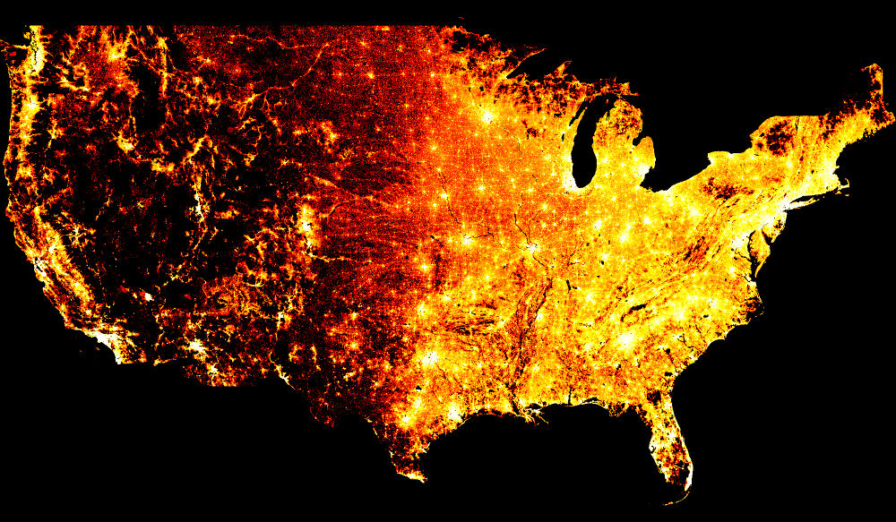
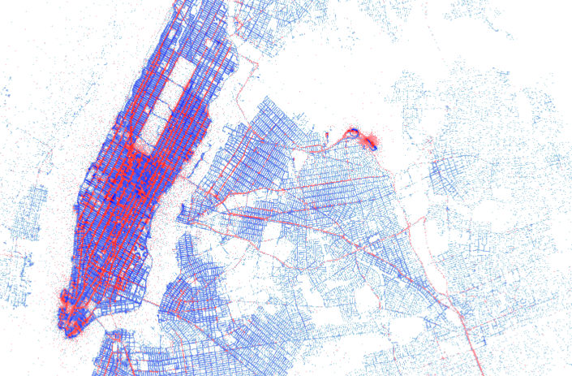

Datashader
----------

[](https://travis-ci.org/bokeh/datashader) 
[](http://datashader.readthedocs.org/en/latest/?badge=latest)
[](https://waffle.io/bokeh/datashader)


Datashader is a graphics pipeline system for creating meaningful
representations of large amounts of data. It breaks the creation of images into
3 steps:

1. Projection

   Each record is projected into zero or more bins, based on a specified glyph.

2. Aggregation

   Reductions are computed for each bin, compressing the potentially large
   dataset into a much smaller *aggregate*.

3. Transformation

   These aggregates are then further processed to create an image.

Using this very general pipeline, many interesting data visualizations can be
created in a performant and scalable way. Datashader contains tools for easily
creating these pipelines in a composable manner, using only a few lines of code.

The project is under active development, and all the code and documentation is
subject to frequent changes.

## Installation

Datashader is available on most platforms using the `conda` package manager,
from the `bokeh` channel:

```
conda install -c bokeh datashader
```

Alternatively, you can manually install from the repository:

```
git clone https://github.com/bokeh/datashader.git
cd datashader
conda install -c bokeh --file requirements.txt
python setup.py install
```

## Examples

Several examples can be found in the `examples` directory.

## Learning more

Additional resources are linked from the
[datashader documentation] (http://datashader.readthedocs.org), including
papers and talks about the approach.

## Screenshots





